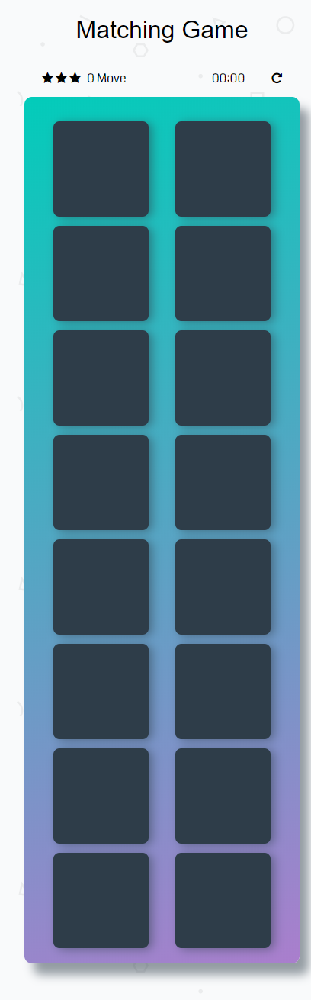

# Memory Game Project
  Classic Memory Game

## Getting Started
  - fork or clone this repo.
  - run it on your local server
  - visit it on your web browser

## Deployment
  Take a look at the live version [https://olumide025.github.io/Memory-Game/](https://olumide025.github.io/Memory-Game/)  

## How to play  
  - Load the game as stated above either on your on browser or live version
  - Clicking on cards will turn them over so that you can see what lies on them.
  - Your goal is to match identical cards with less moves

## Screenshot on mobile of width 375px

  

## Built With
  - HTML
  - CSS
  - Vanilla JAVASCRIPT

## Prerequisites
  - local server
  - web browser

## Versioning
    Git

## Usage and properties
  - view on any device
  - Responsive

# Authors
  Abeeb Ridwan Olumide

## License
 see the [license.md](license.md) file for details
